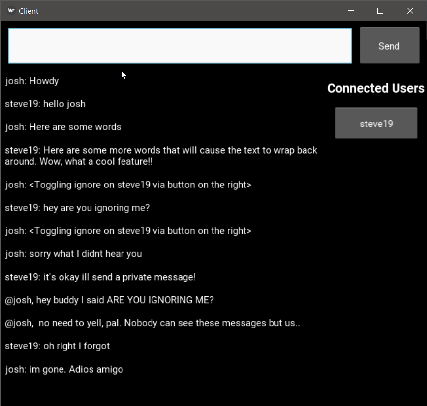

## Asynchronous I/O Chat Program

A Python application that creates a chat room UI for users connected to a server. I wanted to try creating the program using asynchronous I/O rather than the traditional method of multithreading, because it sounded interesting. The GUI is based on Kivy, so the app can be ported to Android and iPhone.

## Motivation

I created this project with three objectives:

1. Gain experience with working on a more complex project, as most of my experience had consisted of scripting or single-file applications.
2. Learn some basics about GUI programming, because I had never created something requiring a fleshed out GUI
3. Explore the new asynchronous library of Python 3.7, because it sounded like an interesting alternative to multi-threading

At the end of the day, I just wanted to gain a better understanding of what is involved in creating a coding project from scratch. I find the best way to learn is to just dive into something over your head. I had an interest in learning about network communications, GUI, and event-driven programs, so this seemed like a good way to do it. It is also a project that I can always think of another feature I would want out of it, so I can continue to build on it. This is building off [my initial experience of making a Pomodoro-technique assistance app](https://github.com/cplant1776/pomodoro_audio_player "Kivy-based Pomodoro audio manager").

## Screenshots

#### Connection Screen:


#### Chatting (josh | steve19):
")
#### Chatting Resized:



## Current Features

* Encrypted server-side stored user credentials, requiring users to log in when connecting
* Public messaging broadcasting to the entire "room" of connected users
* Private messaging between connected users
* Ignore function for blocking messages from specific users
* Symmetric encryption on all communications

## Usage

#### Clone the Repo:
```shell
git clone https://github.com/cplant1776/simple_kivy_chat.git
```
#### Running

Note that You may need to substitute "python3" below for the appropriate command on your system. **This project depends on Python 3.7+** because it is based on recent asyncio library updates.

Server:
```shell
cd simple_kivy_chat/server
python3 server.py
```
The server defaults to a local IP (127.0.0.1) on port 1776. These can be changed by setting the SERVER_IP and SERVER_PORT variables at the top of server.py, respectively (server config file to come in future update).

Client:

```shell
cd simple_kivy_chat/client
python3 main.py
```
The client defaults to port 1776. This can be changed by setting the PORT variable at the top of client_protocol.py (client config file to come in future update).

#### Requirements

##### Python
```
version 3.7.X
```
##### Packages
```
See requirements.txt
```

## Upcoming Changes

* Store user's list of ignored users in database
* Add option to securely locally store user's credentials for easier login
* Test deployment on Android
* General UI improvements
